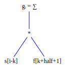
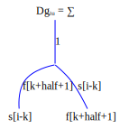
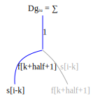
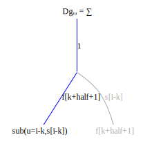
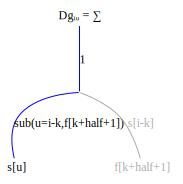
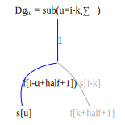
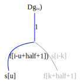
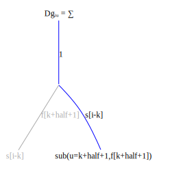
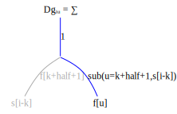
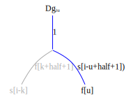

 Create an expression graph for the convolution 
 
 ```math
g_i = \sum\limits_{l} s_{i-l}f_{l + half + 1}
```



Convert the expression graph to a derivative graph 



Now compute the derivative ``\frac{\partial g_i}{\partial s_u}``:



Ccreate a substitution rule for the indices of ``s``:



Propagate the substitution up the derivative graph:





Notice that, as in the matrix vector multiplication example, the substitution in ``\sum\limits_k`` node collapses that node to a no-op since the sum is non-zero only when ``k=i-u``.


Create a FastDifferentiation function to check the derivative:
```julia
function sf()
    s = make_variables(:s, 10)
    f = make_variables(:f, 3)

    half = length(f) ÷ 2
    g(i) = FD.Node(sum((i - l < 1 || i - l > length(s) ? 0 : s[i-l] * f[l+half+1]) for l in -half:half))

    [g(i) for i in 1:lastindex(s)], s, f
end


function Dsf()
    g, s, f = sf()
    return jacobian(g, s), jacobian(g, f)
end
```

Compute the derivative with respect to `s` using FastDifferentiation:


```julia
julia> partial_s,_ = Dsf()


julia> display(partial_s)
10×10 Matrix{FastDifferentiation.Node}:
  f2   f1  0.0  0.0  0.0  0.0  0.0  0.0  0.0  0.0
  f3   f2   f1  0.0  0.0  0.0  0.0  0.0  0.0  0.0
 0.0   f3   f2   f1  0.0  0.0  0.0  0.0  0.0  0.0
 0.0  0.0   f3   f2   f1  0.0  0.0  0.0  0.0  0.0
 0.0  0.0  0.0   f3   f2   f1  0.0  0.0  0.0  0.0
 0.0  0.0  0.0  0.0   f3   f2   f1  0.0  0.0  0.0
 0.0  0.0  0.0  0.0  0.0   f3   f2   f1  0.0  0.0
 0.0  0.0  0.0  0.0  0.0  0.0   f3   f2   f1  0.0
 0.0  0.0  0.0  0.0  0.0  0.0  0.0   f3   f2   f1
 0.0  0.0  0.0  0.0  0.0  0.0  0.0  0.0   f3   f2
```

 Write a function to compute the index solution:
 ```julia
 function index_solution_s()
    s = make_variables(:s, 10)
    f = make_variables(:f, 3)
    half = length(f) ÷ 2

    Dg(i, u) = 1 ≤ i - u + half + 1 ≤ length(f) ? f[i-u+half+1] : 0

    [Dg(i, u) for i in 1:lastindex(s), u in 1:lastindex(s)]
end
```
Compare the index solution results to FastDifferentiation

```julia

julia> index_solution()
10×10 Matrix{Number}:
 f2  f1   0   0   0   0   0   0   0   0
 f3  f2  f1   0   0   0   0   0   0   0
  0  f3  f2  f1   0   0   0   0   0   0
  0   0  f3  f2  f1   0   0   0   0   0
  0   0   0  f3  f2  f1   0   0   0   0
  0   0   0   0  f3  f2  f1   0   0   0
  0   0   0   0   0  f3  f2  f1   0   0
  0   0   0   0   0   0  f3  f2  f1   0
  0   0   0   0   0   0   0  f3  f2  f1
  0   0   0   0   0   0   0   0  f3  f2
```

The index derivative will only require storage space for ``f`` not for the 10x10 derivative matrix. This can be generated on the fly. The zeros of this matrix are implicitly represented in the index constraint equation ``f_{i-u+half+1}``, with out of range indices automatically set to zero.

Now compute the derivative ``\frac{\partial g_i}{\partial f_u}``:







Compute the derivative with respect to ``f`` using FastDifferentiation
```julia

julia> _,partial_f= Dsf()

julia> display(partial_f)
10×3 Matrix{FastDifferentiation.Node}:
  s2   s1  0.0
  s3   s2   s1
  s4   s3   s2
  s5   s4   s3
  s6   s5   s4
  s7   s6   s5
  s8   s7   s6
  s9   s8   s7
 s10   s9   s8
 0.0  s10   s9
```
Compare the result to the index solution
```julia
function index_solution_f()
    s = make_variables(:s, 10)
    f = make_variables(:f, 3)
    half = length(f) ÷ 2

    Dg(i, u) = 1 ≤ i - u + half + 1 ≤ length(s) ? s[i-u+half+1] : 0

    [Dg(i, u) for i in 1:lastindex(s), u in 1:lastindex(f)]
end

julia> index_solution_f()
10×3 Matrix{Number}:
  s2   s1   0
  s3   s2  s1
  s4   s3  s2
  s5   s4  s3
  s6   s5  s4
  s7   s6  s5
  s8   s7  s6
  s9   s8  s7
 s10   s9  s8
   0  s10  s9
```

The index derivative only requires storage space for ``s``, not for the 10x3 derivative matrix, which can be computed dynamically. 

 


