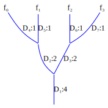

# The Derivative Graph and its use

The derivative graph is a data structure that represents the derivative of a function as a graph. It is both a means of implementing efficient automatic differentiation (AD) algorithms and a perspicuous way of analyzing and understanding AD algorithms. The derivative graph is a powerful new tool which gives the developer great flexibility when designing new general purpose AD systems.

In this document you will learn
* how the derivative graph is related to the original function graph. 
* how the derivative graph is derived from the chain rule of Calculus.
* that there is no fundamental difference between symbolic differentiation and automatic differentiation. You may be surprised to learn that the most efficient AD algorithms are purely symbolic.
* how to design efficient AD algorithms using a few simple heuristics.
* how forward and reverse are essentially the same. 
* how to improve on forward and reverse with an AD algorithm that computes efficient derivatives for any Rⁿ->Rᵐ.
* how algorithms for computing Jv, vᵀJ, and Hv, are structurally identical; they all reduce to simple edge insertion in the derivative graph. 

One path through derivative graph relating \partial 

## The Chain Rule and the Derivative Graph
sum of products of terms where each term is a partial derivative a of function node wrt to one of its children.
### What is Automatic Differentiation anyway?
What is automatic differentiation? An algorithm which computes the sum of products of the edges in the derivative graph, while treating the derivative values at the edges as opaque quantities. The goal of AD algorithm development is to minimize the number of additions and multiplications required to evaluate the sum of products. There are only two ways to do this: factor out common terms and compute common subexpressions so that expressions that are more commonly used are computed before less commonly used expressions. Example:

## Creating an AD algorithm from scratch

###  R¹->R¹

Sort D products by smallest index. Find products with longest shared prefix, $D_i, D_k, ..., D_m$ where $i < k ... < m$. Compute this value as $((D_i D_k) ... D_m$. If the paths  and factor out the prefix from each of the terms. Repeat this factorization recursively.  
$$\begin{equation}
\begin{split}
\frac{\partial f}{\partial x} = D_1 D_2 D_4 + D_1 D_3 D_4 \\
= D_1(D_2 D_4 + D_3 D_4)
\end{split}
\end{equation}
$$
###  R¹->Rⁿ

###  Rⁿ->R¹

### Forward and Reverse
Congratulations, with two simple heuristics you have just derived the forward and reverse AD algorithms. When seen as operations on the derivative graph it is clear that these two algorithms are essentially the same. 

Let's number the edges in the graph by postorder (explanation.). In our sum of products expressions let's order the terms in each product with smallest postorder number to the left. With this convention edges that are lower in the graph will always appear as prefixes of product terms and similarly edges higher in the graph will be suffixes. Example.

Now the fundamental similarity, and difference, between forward and reverse is clear. Forward factors out common *suffix* terms but computes *prefix* subproducts first. Reverse factors out common *prefix* terms but computes *suffix* subproducts first.

What makes understanding forward and reverse difficult is, first, they *implicitly* factor the derivative graph, and, second, they also *implicitly* compute the most used commonly subexpressions first. It is remarkable that nearly optimal factorization and common subexpression evaluation naturally arise from these simple forward or reverse traversals of the derivative graph.

This simplicity and efficiency only miraculously aligns for functions with special structure: f:Rⁿ->R¹ for reverse and f:R¹->Rⁿ for forward. In all other cases forward and reverse fail to optimally factor and order common subexpressions. For f:Rⁿ->Rᵐ in the worst case forward does n*|E| as much work as necessary; the factor for reverse is m*|E|.

Even in the best case forward and reverse can do more work than necessary (example showing prefix and suffix factorization)

### Implicit Factorization
### TimeUsed

## Explicit Factorization and the FD algorithm

## Jv, vᵀJ, and Hv

