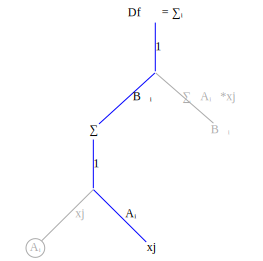

In the first example the summation operator ``\sum\limits_{j}`` disappeared because the summation index and the substitution index were the same. The summation is only non-zero when the summation index equals the substitution so the summation collapsed to a single term. 

The next example shows a case where this is not true: given ``f_k = B_{ki}A_{ij}x_j`` compute ``\frac{\partial f_k}{\partial x_n}``.

First create the function graph corresponding to ``f_k = B_{ki}A_{ij}x_j`` 

Now transform to a derivative graph and gray out edges and nodes which do not contribute to the derivative:


Create the substitution rule by locating  by locating the variable node ``x_j``.


Apply the substitution rule up the graph


No terms higher in the graph than the ``\sum\limits_{j}`` node use the index ``j`` so none of them are affected by the substitution rule ``sub((j=n))``.  


The final result is

```math
\frac{\partial f_k}{\partial x_n} = Df_{kn}= \sum\limits_{i} B_{ki}A_{in}
```

Create a FastDifferentiation function to check the result:
```julia
julia> function BAx()
    B = make_variables(:B, 2, 2)
    A = make_variables(:A, 2, 2)
    x = make_variables(:x, 2)

    f = FD.Node.(B * (A * x))

    jac = jacobian(f, x)
    display(jac)
end
...

julia> BAx()
2×2 Matrix{FastDifferentiation.Node}:
 ((B1_1 * A1_1) + (B1_2 * A2_1))  ((B1_1 * A1_2) + (B1_2 * A2_2))
 ((B2_1 * A1_1) + (B2_2 * A2_1))  ((B2_1 * A1_2) + (B2_2 * A2_2))
```
Write a Julia function to compute the index solution and compare results to FastDifferentiation:
```julia
function index_solution_x()
    B = make_variables(:B, 2, 2)
    A = make_variables(:A, 2, 2)
    [sum([B[k, i] * A[i, n] for i in 1:size(B)[2]]) for k in 1:size(B)[1], n in 1:size(A)[2]]
end

julia> index_solution_x()
2×2 Matrix{FastDifferentiation.Node}:
 ((B1_1 * A1_1) + (B1_2 * A2_1))  ((B1_1 * A1_2) + (B1_2 * A2_2))
 ((B2_1 * A1_1) + (B2_2 * A2_1))  ((B2_1 * A1_2) + (B2_2 * A2_2))
```


