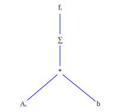
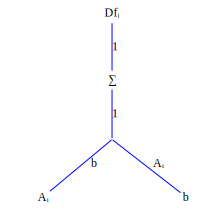
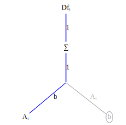
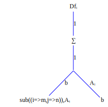
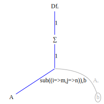
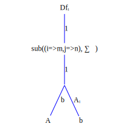
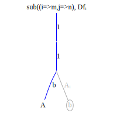
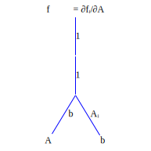

Let's do several examples first, before going into the details of why this works. The first example is: compute ``\frac{\partial f_i}{\partial A_{mn}}`` for ``f_i = A_{ij}b_j``. 

First create the function graph corresponding to the expression ``f_i = A_{ij}b_j``



Now transform to a derivative graph, where ``Df_{imn}`` refers to the derivative ``\frac{\partial f_i}{\partial A_{mn}}`` indexed at ``imn``,




In the graph on the right we've grayed out edges and nodes which don't contribute to ``\frac{\partial f_i}{\partial A_{mn}}``.

Now locate the graph variable corresponding to the variable being differentiated with respect to. This is the node labeled ``A_{ij}``. 

Create a substitution rule to replace the ``i,j`` indices in ``A_{ij}`` with ``m,n``: ``sub((i=m,j=n))``. Apply the substitution to the graph nodes and edges on the product path from ``f_i`` to ``A_{ij}``, beginning with ``A_{ij}`` and working upward:






Notice that the substition ``sub((i=m,j=n),\sum\limits{j})`` collapses to a no-op. This is because the summation is zero except when ``j=n``; there is only one term in the summation. 



In the final substitution change you will notice that the first index of ``Df`` is an equality constraint caused by the substition rule ``sub((i=m,j=n),...)``. All terms ``Df_{i,m,n}`` with ``i \ne m`` are identically 0.

Now multiply all the terms on the product path from node ``Df_{i=m,mn}`` to node ``A_{mn}``. This product is ``Df_{i=m,mmn} = 1*1*b_n = b_n``. 

Although the derivative has three indices ``i,m,n`` the only non-zero elements of this tensor are the elements of ``b_n``. Storing the tensor derivative takes space proportional to the size of ``b_n``. This reduction in storage happens frequently when taking tensor derivatives.


Let's test the symbolic index result we've just computed by writing a FastDifferentiation function to compute the derivative symbolically:
```julia
function Ab()
    A = make_variables(:A, 2, 2)
    b = make_variables(:b, 2)

    jac = jacobian(FD.Node.(A * b), vec(A))
    reshape(jac, 2, 2, 2)
end
export Ab
```
and here's the evaluation:
```julia
julia> Ab()
2×2×2 Array{FastDifferentiation.Node, 3}:
[:, :, 1] =
  b1  0.0
 0.0   b1

[:, :, 2] =
  b2  0.0
 0.0   b2
```
As expected the derivative is non-zero only when the first two indices are equal.


