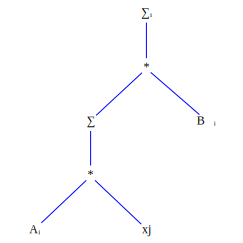
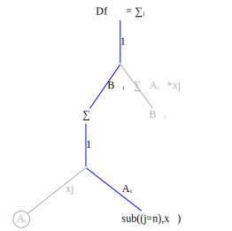
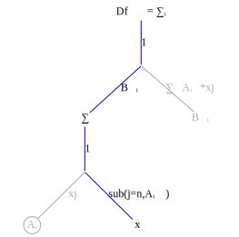
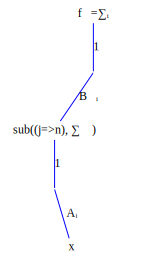
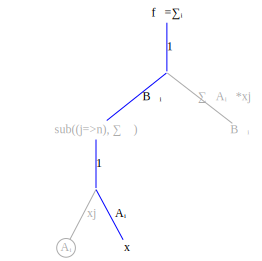

∂sum(j,Aᵢⱼ*bⱼ)/∂bₖ =sum(j,∂(Aᵢⱼ*bⱼ/∂bₖ))
    = sum(j, ∂(Aᵢⱼ*/∂bₖ))*bⱼ + Aᵢⱼ*∂bⱼ/∂bₖ

    ∂bⱼ/∂bₖ = except when j=k when it equals 1. 
    Create expression substitute(j=>k,Aᵢⱼ)
    this gives:
    = sum(j, 0*bⱼ + substitute(j=>k,Aᵢⱼ))
    = substitute(j=>k, sum(j, Aᵢₖ))
    propagate the substitution expression up through the sum
    sum(j=k, Aᵢₖ)
    ∂sum(j,Aᵢⱼ*bⱼ)/∂bₖ = Aᵢₖ


```math
\frac{\partial b_j}{\partial b_k} = \begin{cases}
0  & j \ne k, \\
1 & j=k
\end{cases}
```









