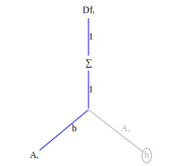
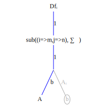
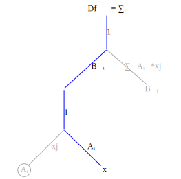

To compute tensor derivatives efficiently we will use a symbolic index representation. This has several benefits:
* Unlike other tensor differentiation systems which may apply many complex tensor identities to simplify an expression we will use a single simple operation: tensor contraction.
* In the symbolic index form all operations are scalar which gives the AD algorithm designer great flexibility to rearrange the order of operations. An important use of this feature is operator fusion. Another is tiling.
* Tensor differentiation tends to create tensors that are sparse. In many cases this sparsity is explicitly represented by constraint equations on the symbolic indices. This dramatically reduces computation and memory usage.

Computing tensor derivatives is conceptually simple, at least for tensor operations that can be represented as sequences of tensor contraction. This may seem restrictive but tensor contraction covers a lot of territory. 

A tensor contraction is a summation along one or more indices. Using Einstein notation a contraction occurs whenever two terms have matching indices. For example, matrix-vector multiplication can be written as a tensor contraction
```math
\begin{aligned}
Ab &= \sum\limits_{j} A_{ij}b{j} \\
&= A_{ij}b_j
\end{aligned}
```

and matrix-matrix multiplication can be written as the tensor contraction ``A_{ij}B_{jk}``. 

Convolution is also a tensor contraction (we'll use the ⨀ symbol for convolution to distinguish it from *):
```math
\begin{aligned}
(s \odot f)_{i} &= \sum\limits_{l} s_{i-l}f{l} \\
&= s_{i-l}*f_l
\end{aligned}
```

Tensor differentiation proceeds in simple steps:

* Write out the indices on the tensor terms. Indices shared between two or more terms indicate a tensor contraction.
* Transform the tensor expression into a function graph.
* Transform the function graph into a derivative graph. Change tensor contractions into summation operation nodes.
* Find the variable being differentiated with respect to and compute index substitutions. 
* Propagate the index substitutions up the graph.

Let's do several examples first, before going into the details of why this works. The first example is: compute ``\frac{\partial f_i}{\partial A_{mn}}`` for ``f_i = A_{ij}b_j``. 

First create the function graph corresponding to the expression ``f_i = A_{ij}b_j``


Now transform to a derivative graph, where ``Df_{imn}`` refers to the derivative ``\frac{\partial f_i}{\partial A_{mn}}`` indexed at ``imn``,




In the graph on the right we've grayed out edges and nodes which don't contribute to ``\frac{\partial f_i}{\partial A_{mn}}``.

Now locate the graph variable corresponding to the variable being differentiated with respect to. This is the node labeled ``A_{ij}``. 

Create a substitution rule to replace the ``i,j`` indices in ``A_{ij}`` with ``m,n``: ``sub((i=m,j=n))``. Apply the substitution to the graph nodes and edges on the product path from ``f_i`` to ``A_{ij}``, beginning with ``A_{ij}`` and working upward:





Notice that the substition ``sub((i=m,j=n),\sum\limits{j})`` collapses to a no-op. This is because the summation is zero except when ``j=n``; there is only one term in the summation. 


In the final substitution change you will notice that the first index of ``Df`` is an equality constraint caused by the substition rule ``sub((i=m,j=n),...)``. All terms ``Df_{i,m,n}`` with ``i \ne m`` are identically 0.

Now multiply all the terms on the product path from node ``Df_{i=m,mn}`` to node ``A_{mn}``. This product is ``Df_{i=m,mmn} = 1*1*b_n = b_n``. 

Although the derivative has three indices ``i,m,n`` the only non-zero elements of this tensor are the elements of ``b_n``. Storing the tensor derivative takes space proportional to the size of ``b_n``. This reduction in storage happens frequently when taking tensor derivatives.


Let's test the symbolic index result we've just computed by writing a FastDifferentiation function to compute the derivative symbolically:
```julia
function Ab()
    A = make_variables(:A, 2, 2)
    b = make_variables(:b, 2)

    jac = jacobian(FD.Node.(A * b), vec(A))
    reshape(jac, 2, 2, 2)
end
export Ab
```
and here's the evaluation:
```julia
julia> Ab()
2×2×2 Array{FastDifferentiation.Node, 3}:
[:, :, 1] =
  b1  0.0
 0.0   b1

[:, :, 2] =
  b2  0.0
 0.0   b2
```
As expected the derivative is non-zero only when the first two indices are equal.


In the first example the summation operator ``\sum\limits_{j}`` disappeared because the summation index and the substitution index were the same. The summation is only non-zero when the summation index equals the substitution so the summation collapse to a single term. 

The next example shows a case where this is not true: given ``f_k = B_{ki}A_{ij}x_j`` compute ``\frac{\partial f_k}{\partial x_n}``.

First create the function graph corresponding to ``f_k = B_{ki}A_{ij}x_j`` 

Now transform to a derivative graph and gray out edges and nodes which do not contribute to the derivative:


Create the substitution rule by locating  by locating the variable node ``x_j``.


Apply the substitution rule up the graph


No terms higher in the graph than the ``\sum\limits_{j}`` node use the index ``j`` so none of them are affected by the substitution rule ``sub((j=n),...)``.  



The final result is

```math
\frac{\partial f_k}{\partial x_n} = Df_{kn}= \sum\limits_{i} B_{ki}A_{in}
```

### Why does it work?

```math
\frac{\partial b_j}{\partial b_k} = \begin{cases}
0  & j \ne k, \\
1 & j=k
\end{cases}
```


