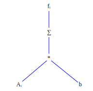
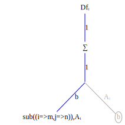
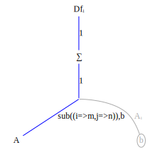
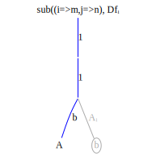
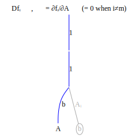
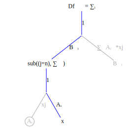

Computing tensor derivatives is conceptually simple, at least for tensor operations that can be represented as sequences of tensor contractions, e.g., ``Ab = \sum\limits_{j} A_{ij}b{j}`` which applies tensor contraction to the ``j`` index. From now on we'll use the notation ``A_{ij}b{j}`` to mean ``\sum\limits_{j} A_{ij}b{j}``

Differentiation proceeds in simple steps:

* Explicitly mark the indices on all tensor terms. Indices shared between two or more terms indicate a tensor contraction.
* Transform the tensor expression into a function graph.
* Transform the function graph into a derivative graph. Change tensor contractions into summation operation nodes.
* Find the variable being differentiated with respect to and compute index substitutions. 
* Propagate the index substitutions up the graph.

Let's do several examples first, before going into the details of why this works. The first example is compute ``\frac{\partial f_i}{\partial A-{mn}}`` for ``f_i = A_{ij}b_j``. 

Begin by creating the function graph corresponding to the expression ``f_i = A_{ij}b_j``



Then transform this into a derivative graph, where ``Df_{imn}`` refers to the derivative of ``f`` indexed at ``imn``,


The variable being differentiated wrt is ``A_{mn}``. Create the substitution ``sub((i=>m,j=>n))`` and apply it to the graph nodes and edges on the product path from ``f_i`` to ``A_{mn}``, beginning with ``A_{mn}`` and working upward:








Notice that the substition ``sub((i=>m,j=>n),\sum\limits{j})`` collapses to a no-op. This is because the summation is zero except when ``j=n``; there is only one term in the summation. 

Now multiply all the terms on the product path from ``f_{mmn}=\frac{\partial f_i}{\partial A-{mn}}`` to ``A_{mn}``. This product is ``Df_{i=m,mmn} = 1*1*b_n = b_n``. Although the result has three indices ``Df_{i=m,mn}`` there is an equality constraint on the first index, create by the substition rule ``sub((i=>m,i=>n),...)``. Only indices which satisfy this constraint are non-zero. For example``Df[1,1,1]=b_1`` but ``Df[1,2,1]=0`` because the first two indices are not equal. 

Even though the derivative is 3 dimensional the only non-zero elements of this tensor are the elements of ``b_n`` so storing the tensor takes space proportional to the size of ``b_n``.


Here's a FastDifferentiation function to compute the derivative symbolically:
```julia
function Ab()
    A = make_variables(:A, 2, 2)
    b = make_variables(:b, 2)

    jac = jacobian(FD.Node.(A * b), vec(A))
    reshape(jac, 2, 2, 2)
end
export Ab
```
and here's the evaluation:
```julia
julia> Ab()
2×2×2 Array{FastDifferentiation.Node, 3}:
[:, :, 1] =
  b1  0.0
 0.0   b1

[:, :, 2] =
  b2  0.0
 0.0   b2
```
As expected the derivative is non-zero only when the first two indices are equal.

As for computation let's compute the product 

LATER
Also note that the order of the summations in the product ``f_{imn}x_{im}`` 
```math
\begin{aligned}
f_{imn}x_{im} &= \sum\limits_{i} \sum\limits_{m} \sum\limits_{n} b_n x_{im} \\
&=  \sum\limits_{n} b_n \sum\limits_{i} \sum\limits_{m} x_{im}
\end{aligned}
```
can be rearranged to take ``im+b`` multiplications rather than ``imb`` multiplications if summed in the original order. Memory and compute efficiency are two key advantages of the explicit index representation.


```math
\frac{\partial b_j}{\partial b_k} = \begin{cases}
0  & j \ne k, \\
1 & j=k
\end{cases}
```

Operations are scalar once they have been converted to index form. Product terms can be computed in any order (Example). This gives the AD algorithm designer great flexibility in deciding how to schedule operations on the processor.


In the first example the summation operator ``\sum\limits_{j}`` disappeared because the summation index and the substitution index were the same. The summation is only non-zero when the summation index equals the substitution so the summation collapse to a single term. 

The next example shows a case where this is not true. Given function ``f_k = B_{ki}A_{ij}x_j`` compute ``\frac{\partial f_k}{\partial x_n}``.

The illustrations show the differentiation starting from the original function graph on the left to the final derivative on the right. At each step the substitution operation ascends one level in the graph.

This is the function graph corresponding to ``f_k = B_{ki}A_{ij}x_j`` 

The differentiation steps are shown in order from left to right. First the substitution variables are found by locating the variable node. In each succeeding step the substitution ascends one level in the graph.


 The final derivative is shown at the far right in the figure below.




In equation form
```math
\frac{\partial f_k}{\partial x_n} = \sum\limits_{i} B_{ki}A_{in}
```


